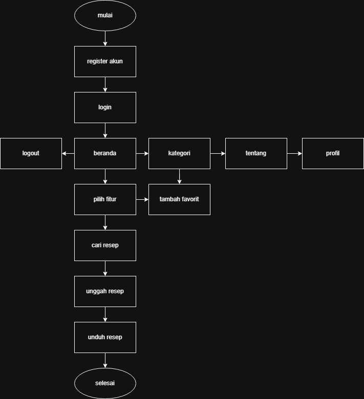

# 🍽️ Cookify – Website Platform Resep Berbasis Flask
Cookify adalah website platform resep masakan berbasis Flask yang memungkinkan pengguna
untuk melakukan registrasi, login, mencari resep, mengunggah resep, dan mengunduh resep.
## Kegunaan Aplikasi
Aplikasi ini digunakan sebagai platform berbagi resep masakan berbasis web yang memudahkan pengguna dalam mencari, mengunggah, dan mengunduh resep, sehingga pengguna dapat mengakses informasi memasak dengan mudah serta meningkatkan keterampilan memasak.
## Flowchart

## Perkenalan Tim
- Ardilla Kurnia Pratama (Mengerjakan fitur kategori, membuat database, membuat video dokumentasi)
- Dina Solehkah (Mengerjakan halaman dashboard, membuat halaman profil, mengisi suara video dokumentasi)
- Umi Luthfitasari (Mengerjakan fitur sorotan, membuat fitur statistik)
- Ngesti Utami P. W. (Membuat fitur unduh resep, membuat halaman login admin)
- Naswa Aura H. (Membuat halaman tentang, membuat halaman login user)
## Link Video Dokumentasi
[^___^](https://youtu.be/IZpHbtONBmM)
